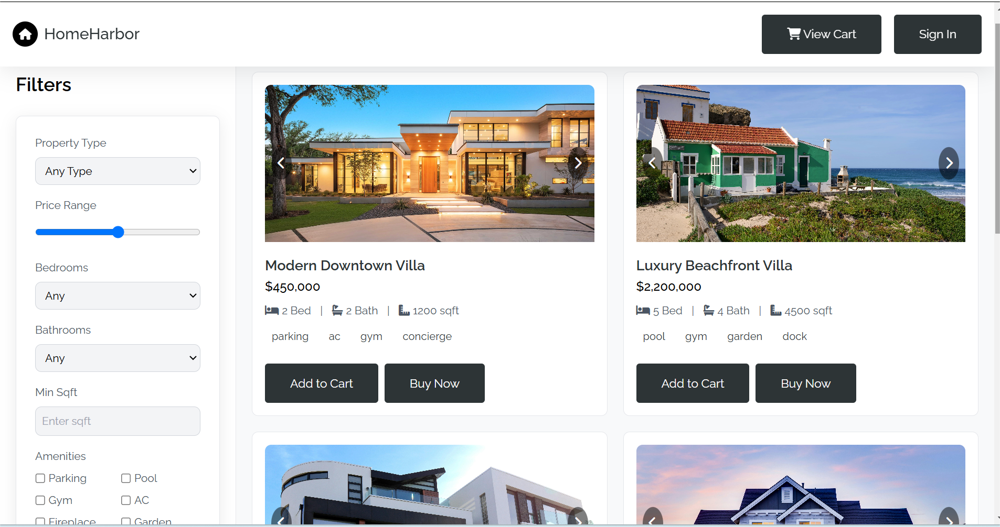

# 🛍️ Simple E-Commerce Website

Welcome to this **responsive e-commerce web project** – a clean, minimal online platform where users can browse, buy, and sell products with ease. Built with pure HTML and CSS, this lightweight frontend prototype is ideal for beginners and frontend practice.




## 🚀 Features

- ✨ Clean, responsive layout
- 🛒 Cart integration with product count
- 🛍️ Buy & Sell product pages
- 📦 Organized structure (index, cart, buy, sell)
- 🎨 Custom modern design

## 📁 Pages Overview

| Page | Description |
|------|-------------|
| `index.html` | Homepage with navbar, hero section, product cards |
| `buy.html` | Grid layout for browsing and buying products |
| `cart.html` | Cart with product listings and checkout button |
| `sell.html` | Form to list a product for sale |

## 📸 UI Preview

> Screenshot above gives a sneak peek of the site layout and aesthetics. Minimalist + Modern UI with a smooth color palette.

---

## 🧠 Tech Stack

- **Frontend:** HTML5, CSS3
- **Tools:** VS Code, GitHub

---

## 🛠️ Setup

1. Clone the repo  
   ```bash
   git clone https://github.com/your-username/ecommerce-site.git
